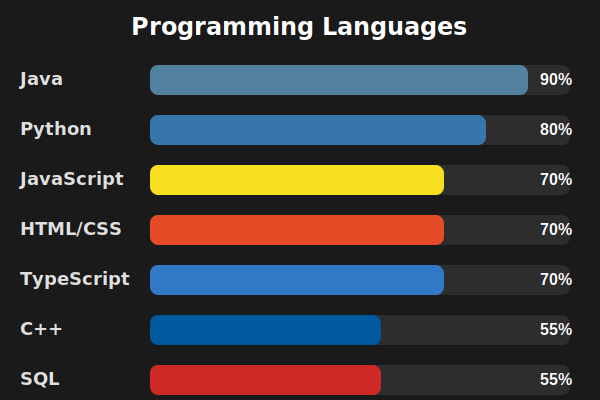

## Hi there! 👋 I'm Chhaya Pradhan

I'm a Computer Science student at Simon Fraser University \
I’m currently focused on strengthening my technical skills through personal projects\
Looking for a Summer 2026 Co-op right now :)

### 💻 Skills
**Languages:** Python · JavaScript · C · Java · SQL · HTML · CSS  
**Full Stack:** React · Next.js · Node.js · Express · .NET  
**Databases:** Supabase · MongoDB 

 

## 📫 You can reach me at:

  
  &nbsp;&nbsp;&nbsp;
  
  &nbsp;&nbsp;&nbsp;

<!--
**chhayaprdn/chhayaprdn** is a ✨ _special_ ✨ repository because its `README.md` (this file) appears on your GitHub profile.

Here are some ideas to get you started:

- 🔭 I’m currently working on ...
- 🌱 I’m currently learning ...
- 👯 I’m looking to collaborate on ...
- 🤔 I’m looking for help with ...
- 💬 Ask me about ...
- 📫 How to reach me: ...
- 😄 Pronouns: ...
- ⚡ Fun fact: ...
-->
